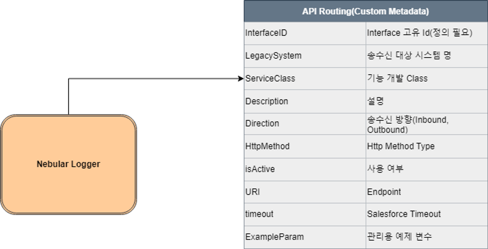

# Salesforce DX Project: Next Steps

Now that you’ve created a Salesforce DX project, what’s next? Here are some documentation resources to get you started.

## How Do You Plan to Deploy Your Changes?

Do you want to deploy a set of changes, or create a self-contained application? Choose a [development model](https://developer.salesforce.com/tools/vscode/en/user-guide/development-models).

## Configure Your Salesforce DX Project

The `sfdx-project.json` file contains useful configuration information for your project. See [Salesforce DX Project Configuration](https://developer.salesforce.com/docs/atlas.en-us.sfdx_dev.meta/sfdx_dev/sfdx_dev_ws_config.htm) in the _Salesforce DX Developer Guide_ for details about this file.

## Read All About It

- [Salesforce Extensions Documentation](https://developer.salesforce.com/tools/vscode/)
- [Salesforce CLI Setup Guide](https://developer.salesforce.com/docs/atlas.en-us.sfdx_setup.meta/sfdx_setup/sfdx_setup_intro.htm)
- [Salesforce DX Developer Guide](https://developer.salesforce.com/docs/atlas.en-us.sfdx_dev.meta/sfdx_dev/sfdx_dev_intro.htm)
- [Salesforce CLI Command Reference](https://developer.salesforce.com/docs/atlas.en-us.sfdx_cli_reference.meta/sfdx_cli_reference/cli_reference.htm)

---

API Framework for Salesforce

Salesforce의 API의 기반을 잡아 유지보수를 용이하게 하고, 개발 속도 향상 및 비용을 낮추기 위해 개발되었습니다.

## Package Install URL - 1.1 
: https://login.salesforce.com/packaging/installPackage.apexp?p0=04t2w0000093nfv

## 주의

- Nebula Logger Package를 사용하기 때문에, 먼저 등록 후 진행해주셔야 합니다.
- Nebula Logger Git URL : https://github.com/jongpie/NebulaLogger

## 특징

1. API Gateway Class를 Inbound, Outbound를 나누고, 서비스 개발 영역도 구분, 파라미터를 구분하여 여러 환경에 대응 가능한 활용성 증대 추구.
2. API Service 정보를 Custom Metadata(API_Routing__mdt)로 관리, API Management를 통해 코드 수정 없이 경로, 사용여부 등 변경 가능하게 하여 개발 및 운영의 용이성 up.
3. Nebula Logger를 활용하여 Log를 API Management에서 서비스 별로 확인 가능.
4. Callout Test Tab을 통해 쉽게 API 테스트 가능.

## API_Routing__mdt

<table>
    <thead>
        <tr>
            <th>API_Routing__mdt</th>
            <th>Field API Name</th>
            <th>Description</th>
        </tr>
    </thead>
    <tbody>
        <tr>
            <td></td>
            <td>InterfaceID__c</td>
            <td>API Service 관리 Id(Key)</td>
        </tr>
        <tr>
            <td></td>
            <td>URI__c</td>
            <td>API Service Endpoint URI</td>
        </tr>
        <tr>
            <td></td>
            <td>HttpMethod__c</td>
            <td>HTTP Method Type</td>
        </tr>
        <tr>
            <td></td>
            <td>isActive__c</td>
            <td>API Service 사용 여부</td>
        </tr>
        <tr>
            <td></td>
            <td>Description__c</td>
            <td>비고</td>
        </tr>
        <tr>
            <td></td>
            <td>ServiceClass__c</td>
            <td>API Service Class Name</td>
        </tr>
        <tr>
            <td></td>
            <td>ExampleParam__c</td>
            <td>호출 예제 파라미터</td>
        </tr>
        <tr>
            <td></td>
            <td>LegacySystem__c</td>
            <td>Outbound 대상 시스템 명</td>
        </tr>
        <tr>
            <td></td>
            <td>Timeout__c</td>
            <td>Read timeout 설정 값</td>
        </tr>
        <tr>
            <td></td>
            <td>Direction__c</td>
            <td>송수신 여부</td>
        </tr>
        <tr>
            <td></td>
            <td>MappingDefinition__c</td>
            <td>Record 매핑 정보</td>
        </tr>
    </tbody>
</table>

## API Manager ERD



## Inbound API Service

*서비스 개발 예시 코드
```java
/*
Body 예시
[
    {
        "NAME" : "TEST"
        ,"MDMCODE" : "TEST"
        ,"PHONE" : "01012345678"
    }
]
*/
public with sharing class API_TEST01_Receiver extends API_Service{
    public API_TEST01_Receiver() {}
    
    //수신, 송신 여부에 따라 해당하는 메소드 오버라이드 하여 개발.
    public override RestResponse execute(RestRequest request, RestResponse response){
        RestResponse result = response;

        try{
            //Request Body를 매핑 클래스 형태에 맞게 변환.
            List<mapperClass> mapperList = (List<mapperClass>)JSON.deserialize(request.requestBody.toString(), List<mapperClass>.class);
            //데이터를 적재할 Object List
            List<Account> objList = new List<Account>();

            //데이터 매핑 작업
            for(mapperClass ifObj : mapperList){
                objList.add(ifObj.convert());
            }

            //데이터 DML 처리
            Insert objList;

            //전달할 Response 정보
            result.responseBody = Blob.valueOf(JSON.serialize(new API_Response(objList)));
        }catch(Exception e){
            API_Response errorResponse = new API_Response();
            errorResponse.createUnhandledExcepionResponse(e.getMessage());
            System.debug(e.getStackTraceString());
            
            // An error occured
            result.statusCode = 500;
            result.responseBody = Blob.valueOf(JSON.serialize(errorResponse));
        }

        return result;
    }

    //매핑 클래스
    public class mapperClass {
        public String NAME      {get;set;}
        public String MDMCODE   {get;set;}
        public String PHONE     {get;set;}

        public Account convert(){
            Account obj = new Account();

            obj.Name = this.NAME;
            obj.AccountNumber = this.MDMCODE;
            obj.Phone = this.PHONE;

            return obj;
        }
    }
}
```

## Outbound API Service

*서비스 개발 예시 코드
```java
/*

송신, 조회 서비스의 경우 Request Body는 내부CRM 담당자와 협의하여 결정한다.

Request Body 예시

{"name":"'value'"}

클래스 선언 규칙은 API_(InterfaceID)_ + 송신은 Sender / 수신은 Receiver / 조회는 Search로 한다.

*/
public without sharing class API_TEST02_Sender extends API_Service{
    //수신, 송신 여부에 따라 해당하는 메소드 오버라이드 하여 개발.
    public override httpResponse execute(API_Request request){
        httpResponse result = new httpResponse();
        try{

            /* Request Body 가공 및 처리 영역 */

            //Request Body를 전달
            result = callout(request);

            /* Response Body 가공 및 처리 영역 */

        }catch(Exception e){
            // An error occured
            result.setStatusCode(500);
            result.setStatus(e.getStackTraceString());
        }

        return result;
    }
}
```

서비스 개발 예시 코드는 어디까지나 예시입니다. 각 서비스의 파라미터는 근 틀만 구성하였기 때문에
위 예시 코드를 따를 필요는 없습니다.